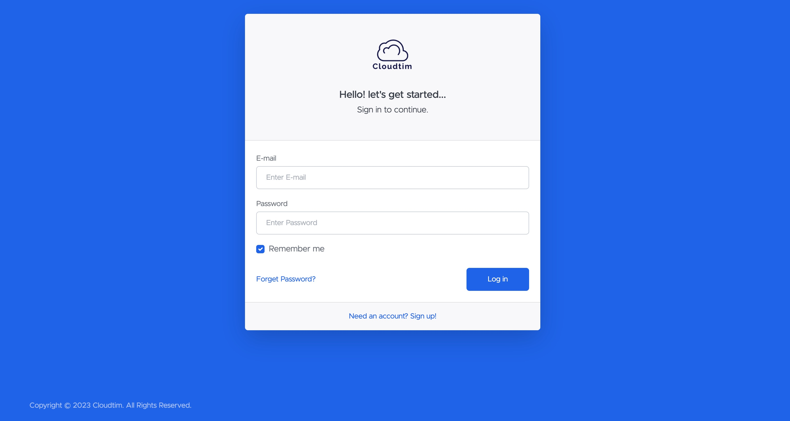

# FASTAPI Template

## Introduction

This FastAPI template can integrate with many popular databases, message queues, and frontend frameworks, making it a very comprehensive web development framework. This repository is a completely open-source project, primarily an out-of-the-box FastAPI Fullstack framework that uses the FastAPI framework to build backend APIs in Python. The project integrates technologies such as MySQL database, Redis cache, and Celery message queue, and supports multiple languages. It also comes with a Bootstrap 5 frontend, completing the fullstack framework. The project's code is hosted on GitHub and can be used, modified, and distributed for free by anyone.

<div class="termy">

## Project Structure:

```console
---- apis
   |----common
   |---- api.py
---- core
----db
   |---- crud
   |---- models
   |---- schemas
   database.py
   redis.py
---- locales
---- logs
---- service
---- static
---- templates
---- utils
.env
babel.cfg
favicon.ico
main.py
README.md
```

</div>

## Requirements

* Python 3.7+
* MySQL
* Redis
* Celery
* Bootstrap 5

## Installation

<div class="termy">

```console
$ git clone https://github.com/autumncn/fastapi_template.git
```

</div>

You will need create a hidden .evn file

```console
SQL_USER=<your SQL Username>
SQL_PASSWORD=<your SQL password>
SQL_SERVER=<your SQL Server Address>
SQL_PORT=<your SQL Server Port>
SQL_DB=<your SQL Database Name>
SECRET_KEY=<Secret Key used in Session>
REDIS_HOST=<your Redis Host>
REDIS_PORT=<your Redis Port>
```

</div>

<div class="termy">to Start:

```console
$ python main.py

```

</div>

## Screenshots

### Login



## Optional Dependencies

Used by Pydantic:

* <a href="https://github.com/esnme/ultrajson" target="_blank"><code>ujson</code></a> - for faster JSON <abbr title="converting the string that comes from an HTTP request into Python data">"parsing"</abbr>.
* <a href="https://github.com/JoshData/python-email-validator" target="_blank"><code>email_validator</code></a> - for email validation.

Used by Starlette:

* <a href="https://www.python-httpx.org" target="_blank"><code>httpx</code></a> - Required if you want to use the `TestClient`.
* <a href="https://jinja.palletsprojects.com" target="_blank"><code>jinja2</code></a> - Required if you want to use the default template configuration.
* <a href="https://andrew-d.github.io/python-multipart/" target="_blank"><code>python-multipart</code></a> - Required if you want to support form <abbr title="converting the string that comes from an HTTP request into Python data">"parsing"</abbr>, with `request.form()`.
* <a href="https://pythonhosted.org/itsdangerous/" target="_blank"><code>itsdangerous</code></a> - Required for `SessionMiddleware` support.
* <a href="https://pyyaml.org/wiki/PyYAMLDocumentation" target="_blank"><code>pyyaml</code></a> - Required for Starlette's `SchemaGenerator` support (you probably don't need it with FastAPI).
* <a href="https://github.com/esnme/ultrajson" target="_blank"><code>ujson</code></a> - Required if you want to use `UJSONResponse`.

Used by FastAPI / Starlette:

* <a href="https://www.uvicorn.org" target="_blank"><code>uvicorn</code></a> - for the server that loads and serves your application.
* <a href="https://github.com/ijl/orjson" target="_blank"><code>orjson</code></a> - Required if you want to use `ORJSONResponse`.

You can install all of these with `pip install "fastapi[all]"`.

## License

This project is licensed under the terms of the MIT license.
